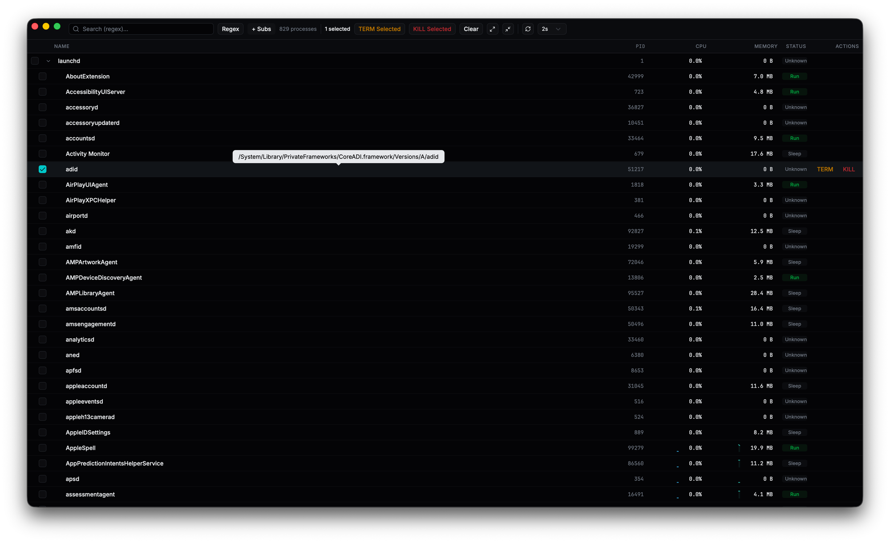

# macos-process-tree

[](https://opensource.org/licenses/MIT)

A native macOS process tree viewer built with Tauri 2. Browse, search, and manage system processes through an interactive hierarchical tree with real-time resource monitoring.



## Problem

The built-in macOS Activity Monitor displays processes as a flat list, making it difficult to understand parent-child relationships between processes. It also lacks bulk process management -- killing multiple processes requires opening each one individually. This app presents a collapsible tree view with real-time sparkline charts, regex/fuzzy search, and multi-select bulk kill -- all rendered in a native macOS window.

## Features

- **Hierarchical process tree** -- expand and collapse process groups to navigate the full process hierarchy
- **Real-time sparkline charts** -- inline CPU and memory usage graphs that update continuously
- **Regex and fuzzy search** -- filter processes by name using regular expressions or fuzzy matching (powered by Fuse.js)
- **Multi-select with bulk kill** -- select multiple processes and send SIGTERM or SIGKILL with a confirmation dialog
- **Virtualized rendering** -- handles thousands of processes smoothly using TanStack Virtual
- **Native macOS title bar** -- uses Tauri's window overlay for a seamless macOS look and feel

## Tech Stack

| Layer     | Technology                                           |
|-----------|------------------------------------------------------|
| Runtime   | [Tauri 2](https://v2.tauri.app/) (Rust backend)     |
| System    | [sysinfo](https://crates.io/crates/sysinfo) crate   |
| Frontend  | [React 19](https://react.dev/) + TypeScript          |
| Compiler  | [React Compiler](https://react.dev/learn/react-compiler) (babel-plugin-react-compiler) |
| Styling   | [Tailwind CSS 4](https://tailwindcss.com/) + [shadcn/ui](https://ui.shadcn.com/) |
| Data      | [TanStack Query](https://tanstack.com/query) / [Table](https://tanstack.com/table) / [Virtual](https://tanstack.com/virtual) |
| Bundler   | [Vite 7](https://vite.dev/)                          |
| Testing   | [Vitest](https://vitest.dev/)                        |
| Package   | [pnpm](https://pnpm.io/)                            |

## Installation

1. Download the latest `.dmg` from the [Releases](https://github.com/doryski/macos-process-tree/releases) page.
2. Open the `.dmg` and drag **macos-process-tree** into your `/Applications` folder.
3. On first launch, macOS Gatekeeper may block the app because it is not notarized. To allow it:
   - Open **System Settings → Privacy & Security**.
   - Scroll down to the **Security** section.
   - Click **Open Anyway** next to the blocked app message.
   - Alternatively, right-click the app in Finder, select **Open**, and confirm in the dialog.

## Getting Started

### Prerequisites

- **Node.js** 20+
- **pnpm** 9+
- **Rust** (install via [rustup](https://rustup.rs/))
- **Xcode Command Line Tools** -- run `xcode-select --install` if not already installed

### Installation

```bash
git clone https://github.com/doryski/macos-process-tree.git
cd macos-process-tree
pnpm install
```

### Development

```bash
pnpm tauri dev
```

This starts the Vite dev server and opens the Tauri window with hot module replacement.

### Build

```bash
pnpm tauri build
```

Produces a native `.app` bundle and `.dmg` installer in `src-tauri/target/release/bundle/`.

### Testing

```bash
pnpm vitest run
```

## Project Structure

```
macos-process-tree/
  src/                    # React frontend
    components/           # UI components (ProcessTable, Toolbar, Sparkline, etc.)
    hooks/                # Custom hooks (useProcessTree, useSelection, useSparklineHistory)
    lib/                  # Utilities (tree-utils, filter, fuzzy-search, format)
    types/                # TypeScript type definitions
  src-tauri/              # Tauri / Rust backend
    src/
      commands.rs         # Tauri command handlers
      process_tree.rs     # Process tree construction via sysinfo
      types.rs            # Rust data structures
  tests/                  # Vitest unit tests
```

## Platform Support

- **macOS** -- fully supported (primary target)
- **Linux / Windows** -- not supported. The app uses macOS-specific Tauri window features and targets macOS process semantics.

## Contributing

Contributions are welcome. Please read the [Contributing Guide](./CONTRIBUTING.md) before opening a pull request.

## License

[MIT](./LICENSE)
